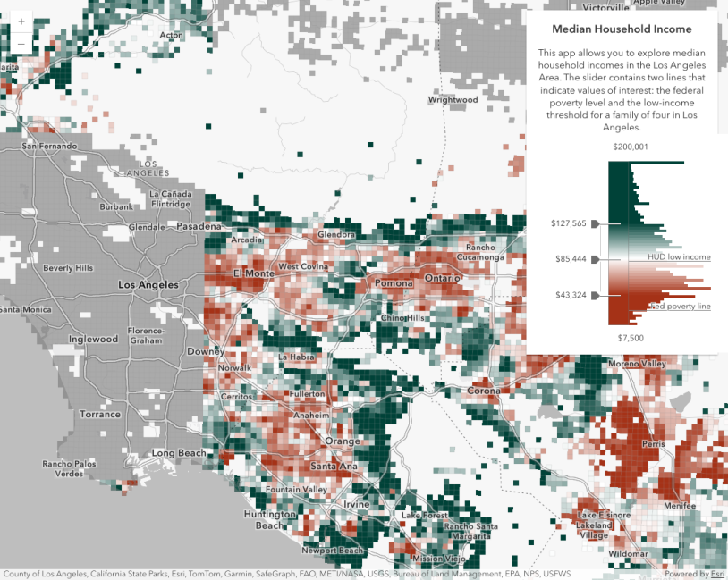
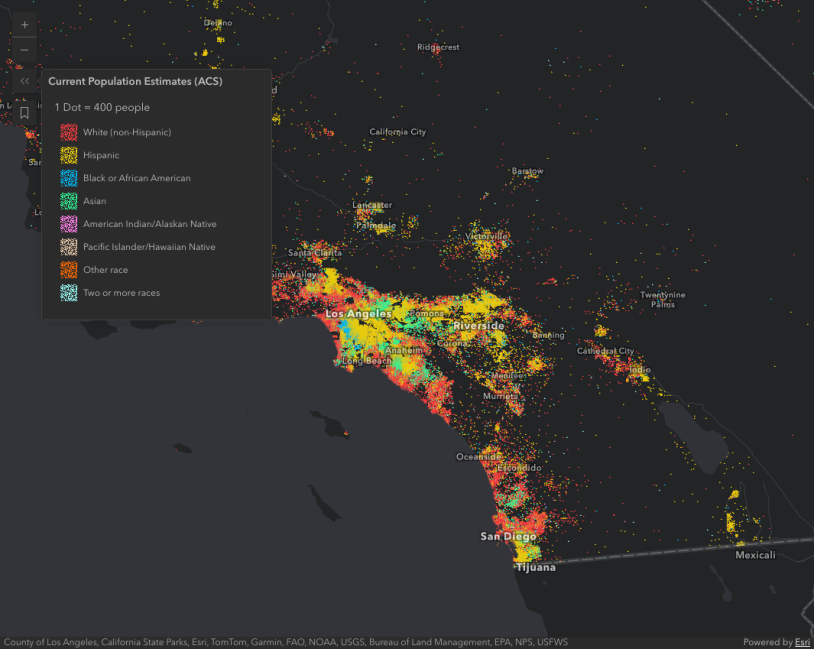
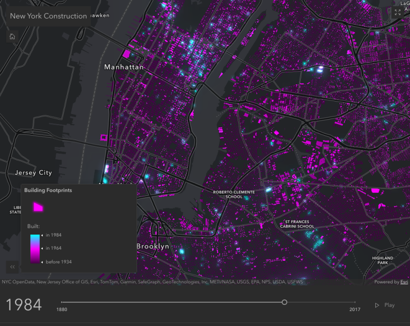
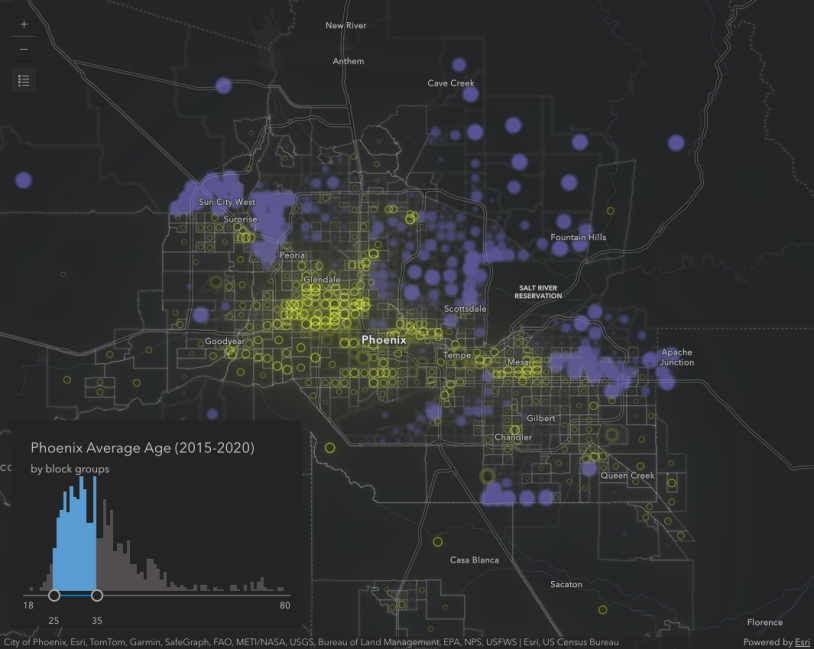
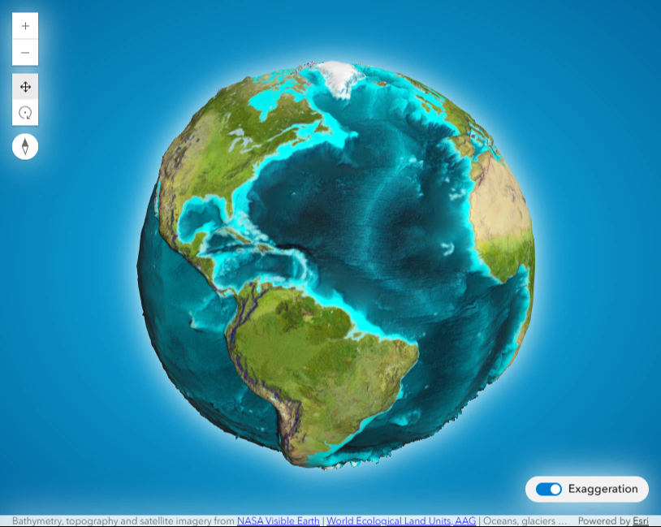
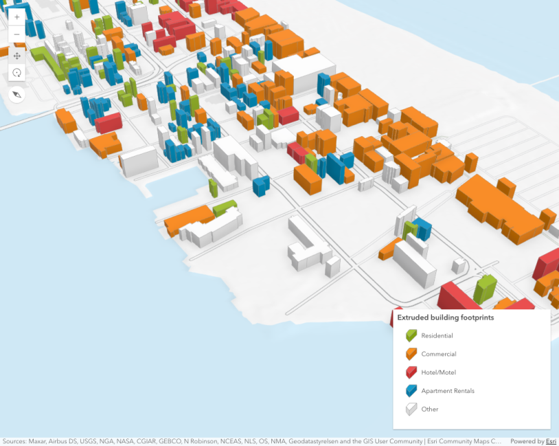
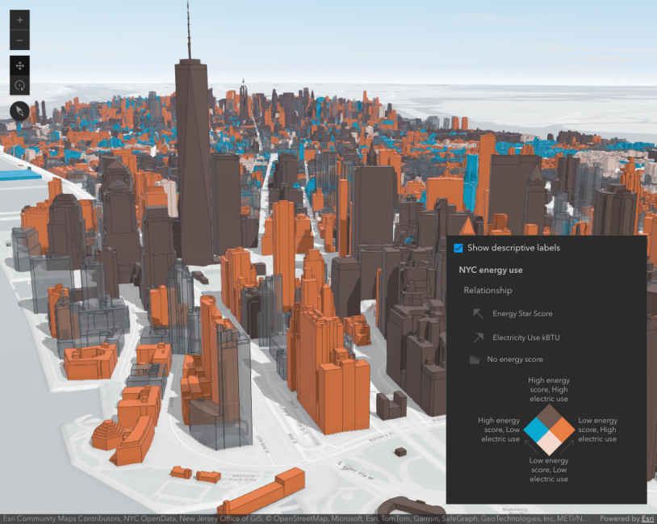

# Interactive Maps

A collection of interactive web maps built with **ArcGIS Maps SDK for JavaScript**, **Esri Calcite Design System**,

<table>
  <tr>
    <td align="center">
      <a href="https://faisalrbk.github.io/interactiveMaps/1-colorSliderHistogramMap.html">
        
         Color Slider Histogram Map
      </a>
    </td>
    <td align="center">
      <a href="https://faisalrbk.github.io/interactiveMaps/2-dotDensityVisulizationMap.html">
        
         Dot Density Visualization Map
      </a>
    </td>
    <td align="center">
      <a href="https://faisalrbk.github.io/interactiveMaps/3-animateColorVisulization.html">
        
         Dot Density Visualization Map
      </a>
    </td>
  </tr>
  <tr>
    <td align="center">
       <a href="https://faisalrbk.github.io/interactiveMaps/4-featureEffect.html">
        
         2D FeatureEffect on Chloropleth Map
      </a>
    </td>
    <td align="center">
       <a href="https://faisalrbk.github.io/interactiveMaps/5-elevationLayer.html">
        
         Custom ElevationLayer | exaggerating elevation
      </a>
    </td>
    <td align="center">
       <a href="https://faisalrbk.github.io/interactiveMaps/6-buildingMap.html">
        
         Extrude building footprints based on real world heights
      </a>
    </td>
  </tr>
  <tr>
    <td align="center">
      <a href="https://faisalrbk.github.io/interactiveMaps/7-3dBuildings.html">
        
         thematic bivariate visualizations of 3D Object SceneLayers.
      </a>
    </td>
  </tr>
</table>
